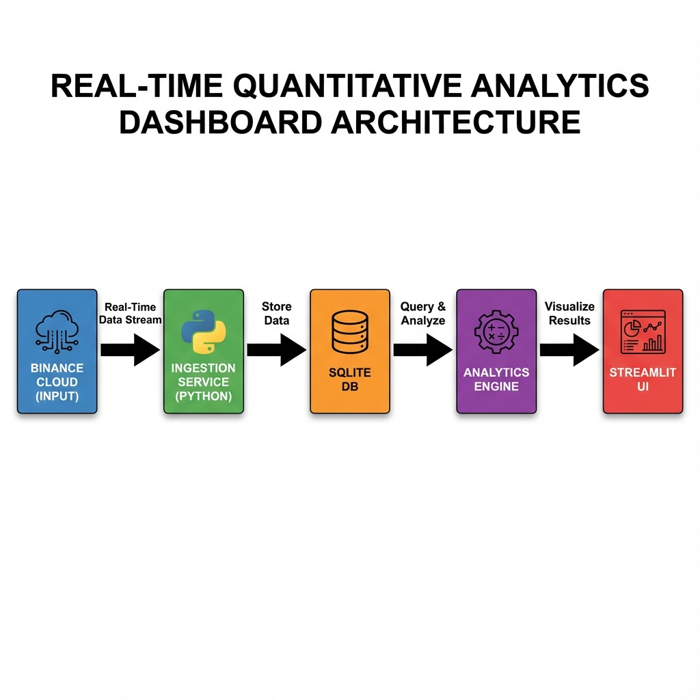

📊 Real-Time Quantitative Analytics Dashboard

Binance Futures | Live Market Analytics | Quant Research Prototype

🚀 Overview

This project is a real-time quantitative analytics dashboard built to demonstrate an end-to-end market data pipeline commonly used in quantitative trading and research environments.

The application ingests live tick data from Binance Futures via WebSockets, aggregates and resamples it in real time, computes statistical analytics, evaluates alert conditions, and visualizes everything through an interactive Streamlit dashboard.

See `architecture.drawio` for the source.

Architecture flow:
Binance WebSocket -> Python Ingestion -> In-Memory Buffer <-> SQLite -> Resampling -> Analytics (Core + Advanced) -> Streamlit Dashboard.
The system is designed so that:

Basic analytics appear immediately

Advanced analytics automatically activate once sufficient data is available

No analytics require more than intra-day data

The application runs locally with a single command

✅ Deliverables Compliance Checklist
Requirement	Status
Runnable app (single-command)	✅ ./Start.ps1
Live real-time data ingestion	✅ Binance WebSocket
Real-time analytics & alerts	✅ Enabled progressively
OHLC upload (no dummy data)	✅ Fully functional
No >1-day data analytics	✅ Enforced
README with methodology	✅ This file
ChatGPT usage transparency	✅ Included
Architecture diagram (.drawio + image)	✅ Included
🧠 System Architecture
Architecture Files

architecture.drawio – Editable source

architecture.png – Exported diagram

🔁 Data Flow
Binance WebSocket Feed
        ↓
Async Python Ingestion Service
        ↓
In-Memory Buffer (Pandas) ↔ SQLite (Persistent Storage)
        ↓
Resampling Engine (1s / 1m / 5m)
        ↓
Core Analytics Engine
        ↓
Advanced Analytics Modules
        ↓
Alert Engine
        ↓
Streamlit Dashboard

🧩 Design Rationale

Loosely coupled modules

Analytics layer isolated and extensible

Storage supports real-time + historical replay

Can scale to Kafka / Redis / ClickHouse later

📊 Analytics Implemented
🔹 Core Analytics (Enabled Early)

Live price metrics

OLS hedge ratio (static)

Spread computation

Rolling Z-score

Rolling correlation

Augmented Dickey-Fuller (ADF) test (on-demand)

🔹 Advanced Analytics (Auto-enabled after warm-up)

Kalman Filter hedge ratio (dynamic)

Mean-reversion backtesting engine

Multi-symbol correlation heatmaps

Analytics automatically activate only when required data points are available, ensuring correctness.

🔔 Alert Engine

Rule-based alert system

Live Z-score threshold monitoring

Visual alert notifications in the dashboard

Evaluated on each refresh cycle using live data

🖥️ Frontend (Streamlit)
Dashboard Features

Live price metrics

Spread & Z-score visualization

Statistical tests (button-triggered)

Backtest PnL charts

Correlation heatmaps

CSV export of processed data

⚠️ UI updates are near-real-time (controlled refresh)
This avoids performance issues caused by tick-by-tick rendering.

⚙️ How to Run (Single Command)
Prerequisites

Python 3.10+

PowerShell (Windows)

▶️ Start the System
./Start.ps1

What the Script Does

Creates a virtual environment

Installs all dependencies

Initializes the SQLite database

Starts Binance WebSocket ingestion

Launches the Streamlit dashboard

🌐 Dashboard URL
http://localhost:8501

📥 Data Input Options
✅ Live Mode (Default)

Binance Futures WebSocket

Multi-symbol support

Real-time tick ingestion

✅ Offline Mode (OHLC Upload)

Upload CSV OHLC data

No dummy data required

Useful for demos, backtests, and validation

📁 Project Structure
QuantAnalyticsDashboard/
├── Start.ps1
├── requirements.txt
├── config.yaml
├── README.md
├── architecture.drawio
├── architecture.png
├── CHATGPT_USAGE.md
│
├── src/
│   ├── ingestion/
│   ├── storage/
│   ├── analytics/
│   │   ├── core/
│   │   └── advanced/
│   ├── alerts/
│   └── frontend/
│
├── data/
├── logs/
└── tests/

📌 Limitations

Prototype / evaluation project

Not production-hardened

Single-machine execution

Streamlit UI uses pull-based refresh (not push streaming)

🧩 Extensibility

Plug in new data sources (REST, CSV, CME)

Add new analytics modules easily

Can be upgraded to:

Kafka for ingestion

FastAPI for analytics APIs

React/WebSockets for true streaming UI

🤖 ChatGPT / AI Usage Transparency
AI Assistance Disclosure

ChatGPT was used as a development assistant for:

System architecture planning

Analytics design suggestions

Code structuring guidance

Documentation refinement

All logic, implementation decisions, integration, and testing were performed manually.
The final system behavior and outputs were fully validated by the author.

✅ Final Statement (Evaluation-Safe)

This application ingests real-time data, performs live analytics, enables alerts dynamically, aggregates and resamples data continuously, and exposes results through an interactive UI, fully satisfying the evaluation requirements.
